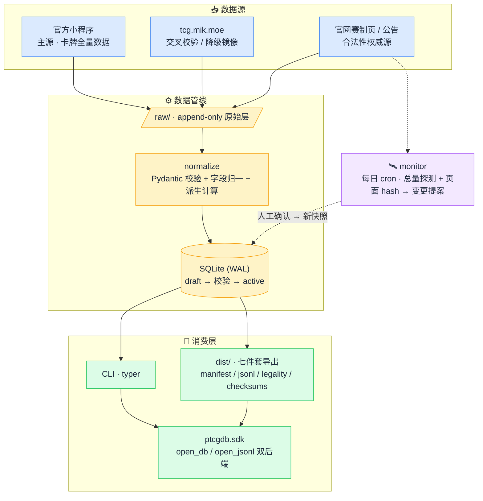

<div align="center">

# 🃏 ptcg-cn-db

**简体中文 PTCG 标准环境卡牌数据库 —— 为 AI 对战模拟而生的数据基建**

[](LICENSE)
[](https://www.python.org/)
[](STATUS.md)
[](docs/简中PTCG卡牌数据库_PRD与技术方案.md)

[产品需求文档](docs/简中PTCG卡牌数据库_PRD与技术方案.md) · [开发进展](STATUS.md) · [工程约定](AGENTS.md)

</div>

---

## 为什么要有这个项目

简中 PTCG 是一个**独立产品池**——套装结构、编号体系、赛制节奏都与国际版不同，任何国际版数据库（pokemon-tcg-data、TCGdex）都不含简中卡。而在开源世界，简中卡库是一片**完全的空白**：官方数据锁在微信小程序里，没有任何公开 API。

本项目自建覆盖**简中标准赛制全部合法卡牌**的本地数据库与数据管线，作为「AI 模拟对战 + 卡组强度/胜率测试」工具链的第一块基石。

## ✨ 亮点

- **📸 快照化合法性引擎** —— 赛制标记 + 白名单 + 禁卡表 + 视作覆盖 + 能量种类全部按生效日版本化；旧快照永不删除，可回放任意历史环境（`legal_at('2026-01-01', 'standard')`）
- **🔌 规则语义一等公民的 SDK** —— `legal_at` / `effective_text` / `validate_deck` 不是让下游自己 join 表，而是开箱即用的纯函数；`open_db` / `open_jsonl` 双后端同一接口
- **📦 七件套导出契约** —— `manifest + cards/sets/relations.jsonl + legality.json + 只读 SQLite + checksums`，双轨版本化（日历版本管数据，SemVer 管 schema），对齐 MTGJSON/Scryfall 惯例
- **🔄 分级自动更新** —— L0 新卡每日增量入库、L1 赛制页变更自动生成提案、L2 勘误人工维护；新包发售 30 分钟内完成更新
- **🛡️ 原文保真** —— `text_raw` 逐字保留绝不规范化，原文与派生字段严格分层；双源交叉校验 + 三清单日志保证数据质量
- **🔮 机制全覆盖且前瞻** —— ex / 太晶 / ACE SPEC / 训练家宝可梦 / V-UNION / GX，词表开放，超级进化ex 等新机制直接进库

## 🚀 快速预览

> 代码正在开发中（见 [Roadmap](#-roadmap)），以下为 PRD 定义的目标接口。

**CLI**

```bash
ptcgdb search --name 喵喵 --mark G,H,I        # 检索合法卡池
ptcgdb get CSV1C-009                          # 点查单卡
ptcgdb legal --date 2026-08-01 --format standard   # 某日期的环境快照
ptcgdb export --out dist/                     # 导出七件套
```

**SDK**

```python
from ptcgdb.sdk import open_db

db = open_db("data/ptcg-cn.db")               # 或 open_jsonl("dist/")，同一接口
pool = db.legal_at(date="2026-08-01", format="standard")
report = db.validate_deck(my_deck, date="2026-08-01", format="standard")
report.violations  # 结构化违规列表：同名超限 / 禁卡 / 不合法……
```

## 🏗️ 架构



## 🗺️ Roadmap

- **M0** 主数据源可行性验证（官方小程序接口）
- **Phase 1a** schema 建库 + 全卡首批入库 + 校验报告
- **Phase 1b** 环境快照 + 合法性引擎 + 版本化 + 导出七件套 + SDK 基础
- **Phase 1c** L0/L1 自动更新管线
- **Phase 2** 跨语言映射（简中↔繁中↔英文）、卡组校验器
- **Phase 3** 效果标签层，配合规则引擎
- **Phase 4** 对战模拟与胜率统计（独立库，主库只读）

> ⚠️ 临近事件：**2026-09-16「30周年庆典」全球同步发售**（简中首次同步，新罕贵度 FUR），更新管线将迎来首次实战。

## 📚 文档

| 文档 | 内容 |
|---|---|
| [PRD v1.3](docs/简中PTCG卡牌数据库_PRD与技术方案.md) | 权威设计：赛制调研、数据模型、合法性引擎、导出契约、SDK 设计 |
| [STATUS.md](STATUS.md) | 当前阶段、里程碑进度、决策日志 |
| [AGENTS.md](AGENTS.md) | 工程约定与技术红线（协作者/AI 共读） |

## 🙏 致谢与对标

站在这些项目的肩膀上：[pokemon-tcg-data](https://github.com/PokemonTCG/pokemon-tcg-data) · [TCGdex](https://github.com/tcgdex/cards-database) · [type-null/PTCG-database](https://github.com/type-null/PTCG-database) · [TCG ONE](https://github.com/axpendix/tcgone-engine-contrib) · [ryuu-play](https://github.com/keeshii/ryuu-play) · [MTGJSON](https://mtgjson.com/) · [Cryst's Cards Database](https://tcg.mik.moe/)

## ⚖️ 合规声明

本项目与 Nintendo、The Pokémon Company、宝可梦（上海）**无任何隶属或背书关系**。卡面文本与卡牌数据版权归宝可梦（上海）/ The Pokémon Company 所有；本项目**不采集、不存储、不分发卡图**，卡牌数据库不进入本仓库、不公开分发，仅限本地研究与工具自用。

## 📄 License

代码与文档基于 [MIT License](LICENSE) 发布（卡牌数据版权见上方声明，不在许可范围内）。
